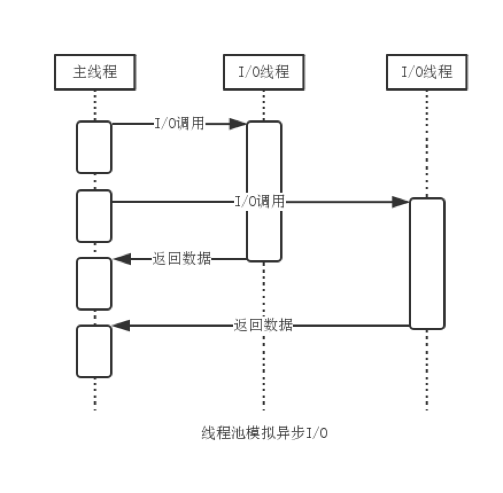
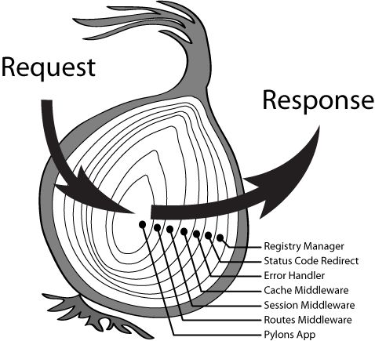
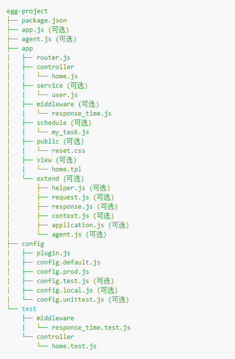

# Node.js之Egg.js框架应用
## 一、Node.js起源与发展
### 1. 起源
Node.js是一个让JavaScript运行在服务端的平台  
Node.js是瑞安·达尔（Ryan Dahl）在2009年写出来的。结合了Google的V8、事件驱动模式和低级I/O接口。  
与顺序编程方式会造成阻塞或消耗更多资源不同，Node.js提供了基于事件驱动和非阻塞的接口，更适用于编写高并发状态下的程序。  
2010年1月，软件包管理系统npm诞生，开发者能更方便的发布和分享Node.js类库及源码，简化了类库安装、升级与卸载的过程。  
2011年6月，微软和达尔所在公司Joyent合作，把Node.js移植到了Windows系统上，改变了原先只支持Linux和Mac OS X操作系统的情况。  
2012年1月，达尔离开了Node.js项目。  
2014年12月，Node.js核心开发者Fedor Indutny因长期对Joyent的管理不满，制作了分支版本io.js  
为了在用户、厂商和开发者之间获取平衡，Node.js基金会在2015年初成立。同年9月，Node4.0发布，Node.js和io.js正式合并。4.0版引入了ES6的语言特性。

Node.js撰写的HTTP Server版Hello World
``` JavaScript
const http = require('http')
http.createServer((request, response) => {
  response.writeHead(200, { 'Content-Type': 'text/plain' });
  response.end('Hello World!');
}).listen(8000);
console.log('Server running at http://127.0.0.1:8000/');
```

### 2. Node.js运行时环境

* V8  
V8是为Google Chrome设计的JavaScript运行引擎。V8用C++写成，它把JavaScript源代码编译成本地机器码后执行
* libuv  
libuv是一个提供异步功能的C库，在运行时负责一个事件循环、一个线程池、文件系统I/O，DNS相关和网络IO以及一些其他重要功能
* 其他底层依赖  
如 c-ares、crypto (OpenSSL)、http-parser 以及 zlib。这些依赖提供了对系统底层功能的访问，包括网络、压缩、加密等  
* 应用模块
即自己书写的Node.js代码，npm install的模块代码
* Binding
一些胶水代码，把C/C++写的一些核心的库接口暴露给JS环境
* Addons
一些胶水代码，调用其他第三方或者自己的C/C++库，需要自己手动完成。本质上都是完成桥接的作用，使得应用与底层库能够互通有无。

### 3. 其他相关术语
* 回调函数(callback)  
把函数A作为参数传递给另一个函数B，B会在达成某种条件之后执行A函数，此时称A为回调函数
``` JavaScript
function handle (err, data) {
  // do something...
}
// 此处handle就是回调函数
fs.readFile('./test.json', handle)
```
* 同步异步
同步：发起一个请求后需要等到结果返回才能处理其他任务
异步：发起一个请求后不等结果返回，可处理其他任务，等到结果返回后再处理  
  > 从编程角度理解，同步IO就是进程/线程发起IO调用后，需要等待操作系统 完成IO工作并告知进程已完成，进程/线程才能继续往下执行其他指令。  
  >异步IO就是进程/线程发起IO调用后，不必等待操作系统IO执行完毕，可直接继续往下执行其他指令。操作系统完成IO后，当前进程/线程会得到通知

* 阻塞非阻塞
阻塞和非阻塞关注的是**程序在等待调用结果（消息，返回值）时的状态**  
阻塞调用是指调用结果返回之前，当前线程会被挂起。调用线程只有在得到结果之后才会返回。  
非阻塞调用指在不能立刻得到结果之前，该调用不会阻塞当前线程。
* 单线程  
Node.js的单线程指的是JavaScript代码的执行是单线程的（开发者编写的代码运行在单线程环境中），把需要做的I/O交给libuv，I/O完成后会执行开发者定义的回调函数  

  优势：
  * 适合高并发的应用场景
  * 线程安全，编写程序不必考虑线程切换
  * 比多线程占用资源少，没有创建、切换、销毁线程的开销

  劣势：
  * 不适合CPU密集型计算应用
  * 无法利用多核CPU
  * 单线程抛出异常使整个程序停止

  线程(Process)和进程(Thread)
  > 进程是操作系统执行的基本单元；线程是进程执行的基本单元  
  > 晋城市资源分配的单元，线程是执行的基本单元  
  > 一个程序至少有一个进程，一个进程至少有一个线程  
  > 进程间切换代价大，线程间切换代价小  
  > 进程拥有资源多，线程拥有资源少  
  > 进程间拥有独立的内存单元，同进程下的线程共享内存  
  > 单核CPU同一时间只能执行一个进程/线程，每个任务交替执行  
  > 都是CPU工作时间段的描述

* 事件循环(EventLoop)  
Node.js的主线程维护了一个事件队列，在碰到如文件读写、网络连接等异步任务时，会把任务放到事件队列中，然后继续执行剩余代码。  
当主线程空闲时，即开始循环事件队列，检查是否有要处理的事件  
若是非I/O任务则亲自处理，并通过回调函数返回到上层调用；若是I/O任务则从线程池拿出一个线程处理该事件并指定回调函数。然后继续循环队列中其他事件。  
当线程中的I/O任务完成后执行指定的回调函数，并把这个完成的事件放到事件队列尾部，等待事件循环，当主线程再次循环到该事件时，就直接处理并返回给上层调用。  
这整个流程就是事件循环。


### 4. 与JavaScript的关系
Node.js为JavaScript提供了在服务端运行的环境
Node.js之于JavaScript类似浏览器之于JavaScript
浏览器端：
> ECMAScript，描述了JavaScript语言的语法和基本对象
> 文档对象模型(DOM)，描述处理网页内容的方法和接口
> 浏览器对象模型(BOM)，描述与浏览器进行交互的方法和接口
服务器端：
> ECMAScript
> Node.js内置模块：文件系统I/O、网络(HTTP/TCP)、加密算法等

### 5. ECMAScript
ECMAScript是由Netscape的布兰登·艾克(Brendan Eich)开发的脚本语言JavaScript的标准化规范  
1996年11月，Netscape将JavaScript提交给欧洲计算机制造商协会(Ecma)进行标准化。ECMA-262的第一个版本于1997年6月被Ecma组织采纳。  
ECMAScript是由ECMA-262标准化的脚本语言的名称  
ECMAScript与JavaScript之间的关系是，前者是规格，后者是实现  
实现了ECMAScript的还有JScript和ActionScript  

|版本|发布日期|与前版本的差异|
|:--|:--:|:--|
|1|1997年6月|首版
|2|	1998年6月|	格式修正，以使得其形式与ISO/IEC16262国际标准一致|
|3|	1999年12月|	强大的正则表达式，更好的词法作用域链处理，新的控制指令，异常处理，错误定义更加明确，数据输出的格式化及其它改变|
|4|	放弃|	由于关于语言的复杂性出现分歧，第4版本被放弃，其中的部分成为了第5版本及Harmony的基础|
|5|	2009年12月|	新增“严格模式（strict mode）”，一个子集用作提供更彻底的错误检查,以避免结构出错。澄清了许多第3版本的模糊规范，并适应了与规范不一致的真实世界实现的行为。增加了部分新功能，如getters及setters，支持JSON以及在对象属性上更完整的反射|
|5.1|2011年6月|	ECMAScript标5.1版形式上完全一致于国际标准ISO/IEC 16262:2011。|
|6|	2015年6月|	ECMAScript 2015（ES2015），第 6 版，最早被称作是 ECMAScript 6（ES6），添加了类和模块的语法，其他特性包括迭代器，Python风格的生成器和生成器表达式，箭头函数，二进制数据，静态类型数组，集合（maps，sets 和 weak maps），promise，reflection 和 proxies。作为最早的 ECMAScript Harmony 版本，也被叫做ES6 Harmony。|
|7|	2016年6月|	ECMAScript 2016（ES2016），第 7 版，多个新的概念和语言特性|
|8|	2017年6月|	ECMAScript 2017（ES2017），第 8 版，多个新的概念和语言特性|
|9|	2018年6月|	ECMAScript 2018 （ES2018），第 9 版，包含了异步循环，生成器，新的正则表达式特性和 rest/spread 语法。|
|10|	2019年6月|	ECMAScript 2019 （ES2019），第 10 版|


### 6. 安装与版本更替
* windows环境  
可根据自己需要在官网选择安装包[下载](https://nodejs.org/dist/)安装  

* Linux环境  
建议使用nvm安装Node.js方便版本管理与切换
  > 安装nvm  
  > $ curl -o- https://raw.githubusercontent.com/creationix/nvm/v0.33.8/install.sh | bash  
  > 查看nvm可安装版本  
  > $ nvm ls-remote  
  > 安装指定版本  
  > $ nvm install v6.11.0  
  > 卸载指定版本  
  > $ nvm uninstall v6.11.0  
  > 切换使用版本  
  > $ nvm use v9.5.0  
  > 查看当前Node.js版本  
  > $ node -v

## 二、Node.js框架
### 1. 当前流行框架介绍
* Express  
Express是一个最小且灵活的Web应用程序框架，为Web和移动应用程序提供了一组强大的功能，它的行为就像一个中间件，可以帮助管理服务器和路由
* Koa  
Koa 是一个新的 web 框架，由 Express幕后的原班人马打造，致力于成为web应用和API开发领域中的一个更小、更富有表现力、更健壮的基石。
* Hapi
Hapi是基础功能相对丰富的框架。开发人员更专注于业务，而不是花时间构建基础架构。
* Nest.js  
Nest 是一个用于构建高效，可扩展的 Node.js 服务器端应用程序的框架。它使用渐进式 JavaScript，基于Express，内置并完全支持 TypeScript。
* Egg.js
Egg是一个用于构建高效企业级应用的框架，基于Koa开发，具有高度可扩展的插件机制，内置多进程管理。
### 2. 各框架对比
|序号|框架|GitHub星数|npm下载量|
|:--|:--|:--|:--|
|1|Express|46.3k|11,170,944|
|1|Koa|27.9k|403,612|
|1|Hapi|11.8k|157,307|
|1|Nest.js|21.7k|156,349|
|1|Egg.js|14.3k|5,803|

## 三、Egg.js安装入门
### 0. 中间件
Koa洋葱模型
  
所有请求经过一个中间件都会执行两次，前后的界限在 next 函数
### 1. 脚手架安装
推荐使用脚手架，只需几条指令即可生成项目(npm >= 6.1.0)
> $ mkdir egg-example && cd egg-example  
> $ npm init egg --type=simple  
> $ npm i

启动项目
> $ npm run dev
> open http://localhost:7001

### 2. 逐步搭建
逐步搭建可以更好地了解Egg.js
* 2.1 初始化项目
初始化目录结构
> $ mkdir egg-example  
> $ cd egg-example  
> $ npm init  
> $ npm i egg --save  
> $ npm i egg-bin --save-dev

添加 `npm scripts` 到 `package.json`
``` JSON
{
  "name": "egg-example",
  "scripts": {
    "dev": "egg-bin dev"
  }
}
```
* 2.2 编写Controller
``` JavaScript
// app/controller/home.js
const Controller = require('egg').Controller
class HomeController extends Controller {
  async index() {
    this.ctx.body = 'hello world'
  }
}
module.exports = HomeController
```
配置路由映射
``` JavaScript
// app/router.js
module..exports = app => {
  const { router, controller } = app
  router.get('/', controller.home.index)
}
```
添加配置文件
``` JavaScript
// config/config.default.js
exports.keys = "自己的cookie安全字符串";
```
此时可以启动应用体验下
> $ npm run dev  
> $ open http://localhost:7001

* 2.3 静态资源
Egg 内置了 static 插件，线上环境建议部署到 CDN，无需该插件。
static 插件默认映射 `/public/* -> app/public/*` 目录
此处，我们把静态资源都放到 `app/public` 目录即可

* 2.4 模板渲染
框架不强制使用某种模板引擎，只是约定了 View插件开发规范
> $ npm i egg-view-nunjucks --save


## 三、Egg.js基础功能
### 1. 目录结构

框架约定目录简单说明
> app/router.js 用于配置URL路由规则  
> app/controller/** 用于解析用户输入，处理后返回相应的结果  
> app/service/** 用于编写业务逻辑层，可选  
> app/middleware/** 用于编写中间件，可选  
> app/public/** 用于防止静态资源，可选  
> app/extend/** 用于框架的扩展，可选  
> config/config.{env}.js 用于编写配置文件  
> config/plugin.js 用于配置需要加载的插件  
> test/** 用于单元测试  
> app.js和agent.js用于自定义启动时的初始化工作，可选  
> app/schedule/** 用于定时任务，可选  
> app/view/** 用于放置模板文件，可选  
> app/model/** 用于放置里领域模型，可选  

### 2. 内置对象
Egg内置了一些基础对象  
包括从Koa继承的四个对象Application, Context, Request, Response  
以及框架扩展的一些对象Controller, Service, Helper, Config, Logger

* Application  
Application 是全局应用对象，在一个应用中只会实例化一个，继承自Koa.Application  
  获取方式  
  * 启动自定义脚本获取
  ``` JavaScript
  // app.js
  module.exports = app => {
    app.cache = new Cache()
  }
  ```
  * Controller文件
  ``` JavaScript
  // app/controller/user.js
  class UserController extends Controller {
    async fetch () {
      this.ctx.body = this.app.cache.get(this.ctx.query.id)
    }
  }
  ```
  * 通过Context对象访问
  ``` JavaScript
  // app/controller/user.js
  class UserController extends Controller {
    async fetch () {
      this.ctx.body = this.ctx.app.cache.get(this.ctx.query.id)
    }
  }
  ```
   
* Context  
  Context是一个请求级别的对象，继承自Koa.Context  
  每次接受到用户请求时，框架会实例化一个Context对象，该对象封装了这次用户请求的信息，以及一些便捷的方法获取请求参数、设置响应信息
  获取方式有 Middleware/Controller/Service
  ``` JavaScript
  async function middleware(ctx, next) {
    console.log(ctx.query)
  }
  ```
  在定时任务中每个task都接受一个Context实例作为参数，方便业务逻辑执行
  ``` JavaScript
  // app/schedule/refresh.js
  exports.task = async ctx => {
    await ctx.service.posts.refresh()
  }
  ```

* Request & Response  
  Request 和 Response 都是请求级别的对象，分别继承自 Koa.Request 和 Koa.Response，封装了Node.js原生的HTTP Request/Response对象  
  获取方式：可在 Context 的实例上获取当前请求的 Request(`ctx.Request`) 和 Response(`ctx.response`)
  ``` JavaScript
  // app/controller/user.js
  class UserController extends Controller {
    async fetch () {
      const {app, ctx} = this
      const id = ctx.request.query.id
      ctx.response.body = app.cache.get(id)
    }
  }
  ```
  `ctx.request.query.id` 等价于 `ctx.query.id`  
  `ctx.response.body = ` 等价于 `ctx.body = `  
  获取 post 的 body 应该使用 `ctx.request.body` 而不是 `ctx.body`

* Controller  
  框架提供了一个 Controller 基类，推荐所有 Controller 都继承之  
  该基类有如下属性
  > ctx 当前请求的 Context 实例  
  > app 应用的 Application 实例  
  > config 应用的配置  
  > service 应用所有的 service  
  > logger 为当前 controller 封装的 logger 对象  

  获取 Controller 的两种方法
  ``` JavaScript
  // app/controller/user.js
  // 1. 从 egg 上获取
  const Controller = require('egg').Controller
  class UserController extends Controller {
    // implement
  }
  module.exports = UserController

  // 2. 从 app 实例上获取
  module.exports = app => {
    return class UserController extends app.Controller {
      // implement
    }
  }
  ```
* Service
  框架提供了一个 Service 基类，推荐所有的 Service 都继承之  
  Service 基类的属性和 Controller 基类的属性一致，访问方式也类似
  ``` JavaScript
  // app/service/user.js
  // 1. 从 egg 上获取(推荐)
  const Service = require('egg').Service
  class UserService extends Service {
    // implement
  }
  module.exports = UserService

  // 2. 从 app 实例上获取
  module.exports = app => {
    return class UserService extends app.Service {
      // implement
    }
  }
  ```
* Helper  
  Helper 用来提供一些实用的 utility 函数。  
  我们可以把一些常用动作抽离在 helper.js 里成为一个独立函数  
  获取方式：在 Context 实例上获取当前请求的 Helper(`ctx.helper`) 实例
  ``` JavaScript
  // app/controller/user.js
  class UserController extends Controller {
    async fetch () {
      const { app, ctx } = this
      const id = ctx.query.id
      const user = app.cache.get(id)
      ctx.body = ctx.helper.formatUser(user)
    }
  }
  ```
  自定义 helper 方法，比如上例的 `formatUser`
  ``` JavaScript
  // app/extend/helper.js
  module.exports = {
    formatUser(user) {
      return only(user, ['name', 'phone'])
    }
  }
  ```
  
* Config  
  应用开发应遵循配置和代码分离的原则，所有框架/插件/应用的配置都可通过 Config 对象获取到  
  获取方式： 
  * 通过 `app.config` 从 Application 实例上获取到 config 对象  
  * 在 Controller/Service/Helper 的实例上通过 `this.config` 获取

* Logger
  框架内置了日志功能，每个 logger 对象都提供了四个级别的方法
  * logger.debug()
  * logger.info()
  * logger.warn()
  * logger.error()  

  **App Logger**  
  可以通过 app.logger 获取，记录一些应用级别的日志，如启动阶段的一些数据信息  
  **Context Logger**  
  可以通过 ctx.logger 来获取，打印一些与当前请求相关的信息
  **Controller Logger & Service Logger**  
  可在 Controller 和 Service 实例上通过 this.logger 获取，本质上还是一个 Context Logger

* Subscription  
  订阅模型，一种常见的开发模式，如消息中间件的消费者或调度任务。  
  我们使用 Subscription 基类来规范化这个模式

### 3. 运行环境
一个 Web 应用本身应该是无状态的，可根据环境设置自身
* 指定运行环境
  有两种方式
  * 通过 `config/env` 文件指定，该文件内容就是运行环境
  ``` 
  // config/env
  prod
  ```
  * 通过 `EGG_SERVER_ENV` 环境变量指定  
  如通过 `EGG_SERVER_ENV=prod npm start` 以生产环境启动应用
* 应用内获取运行环境  
  可通过代码 `app.config.env` 获取当前运行环境
* 自定义环境  
  常规开发流程可能除了本地环境、测试环境、生产环境外还有其他环境  
  比如要为开发流程增加集成测试环境SIT，将 `EGG_SERVER_ENV` 设置为 `sit`，启动时会加载 `config/config.sit.js`，运行环境变量 `app.config.env` 会被设置成 `sit`

### 4. 配置
框架会自动合并应用、插件、框架的配置，按顺序覆盖，且根据环境维护不同的配置，合并后的配置通过 `app.config` 获取

**多环境配置**  
框架支持根据环境来加载配置，定义多个环境的配置文件
> config.default.js  
> config.prod.js  
> config.unittest.js  
> config.local.js  

`config.default.js` 为默认的配置文件，所有环境都会加载  
当指定 env 时会加载对应的配置文件，并覆盖默认配置文件的同名配置  
如 `prod` 环境会加载 `config.prod.js` 和 `config.default.js` 两个文件，并且前者会覆盖后者的同名配置

**配置写法**
~~~ JavaScript
// 配置 logger 文件的目录， logger 默认配置由框架提供
module.exports = {
  logger: {
    dir: '/home/admin/logs/demoapp'
  }
}
// 配置文件也可以简化成另一种形式
exports.keys = 'my-cookie-secret-key'
exports.logger = {
  level: 'DEBUG'
}
// 配置文件也可以返回一个 function，接受 appInfo 参数
const path = require('path')
module.exports = appInfo => {
  return {
    logger: {
      dir: path.join(appInfo.baseDir, 'logs')
    }
  }
}
~~~
appInfo 的属性有
> pkg, 即 package.json  
> name, 应用名，同 pkg.name  
> baseDir, 应用代码的目录  
> HOME, 用户目录，如 admin 账户为 /home/admin  
> root, 应用根目录，只有在 local 和 unittest 环境下为 baseDir，其他都为 HOME

**配置加载顺序**
应用、插件、框架都可以定义这些配置，而且目录结构都是一致的  
优先级： 应用 > 框架 > 插件
比如在 prod 环境配置加载顺序如下，后加载的会覆盖前者的同名配置
> 插件 config.default.js  
> 框架 config.default.js  
> 应用 config.default.js  
> 插件 config.prod.js  
> 框架 config.prod.js  
> 应用 config.prod.js  

**配置结果**  
框架在启动时，会把合并后的最终配置 dump 到 `run/application_config.json` (worker 进程) 和 `run/agent_config.json` (agent 进程) 中  
还会生成 `run/application_config_meta.json` (worker 进程) 和 `run/agent_config_meta.json` (agent 进程)文件，用来排查属性来源

### 中间件
* 编写中间件  
**写法**  
一个简单的 gzip 中间件实例
~~~ JavaScript
// app/middleware/gzip.js
const isJSON = require('koa-is-json')
const zlib = require('zlib')
async function gzip (ctx, next) {
  await next()
  let body = ctx.body
  if (!body) return
  if (isJSON(body)) body = JSON.stringify(body)

  // 设置 gzip body, 修正响应头
  const stream = zlib.createGzip()
  stream.end(body)
  ctx.body = stream
  ctx.set('Content-Encoding', 'gzip')
}
~~~
**配置**  
中间件也有自己的配置，一个中间件文件 exports 一个普通的 function，接收两个参数: options(中间件的配置项)和 app(当前Application实例)  
优化上面的 gzip 中间件，指定只有当 body 大于配置的 threshold 时才进行压缩
~~~ JavaScript
// app/middleware/gzip.js
const isJSON = require('koa-is-json')
const zlib = require('zlib')

module.exports = options => {
  return async function gzip (ctx, next) {
    await next()
    let body = ctx.body
    if (!body) return
    if (options.threshold && ctx.length < options.threshold) return 
    if (isJSON(body)) body = JSON.stringify(body)

    // 设置 gzip body, 修正响应头
    const stream = zlib.createGzip()
    stream.end(body)
    ctx.body = stream
    ctx.set('Content-Encoding', 'gzip')
  }
}
~~~
* 使用中间件  
中间件编写完成后需要手动挂载，在 `config.default.js` 中加入如下下配置即可
~~~ JavaScript
module.exports = {
  // 配置需要的中间件，数组顺序即中间件加载顺序
  middleware: [ 'gzip' ],

  // 配置 gzip 中间件的配置
  gzip: {
    threthold: 1024, // 小于 1k 的响应体不压缩
  }
}
~~~
该配置最终将在启动时合并到 app.config.appMiddleware

**router中使用中间件**  
上述配置的中间件是全局的，每次请求都会处理，如果想针对单个路由，可在 `app/router.js` 中实例化和挂载
~~~ JavaScript
module.exports = app => {
  const gzip = app.middleware.gzip({ threshold: 1024 })
  app.router.get('/needzip', gzip, app.controller.handler)
}
~~~

* 框架默认中间件  
  除了应用层加载中间件外，框架自身和其他插件也会加载一些中间件  
  这些中间件配置项都通过在配置中修改同名配置项进行修改  
  如框架自带中间件有一个 bodyParser 中间件，可在 `config/config.default.js` 中修改 bodyParser 的配置
  ~~~ JavaScript
  module.exports = {
    bodyParser: {
      jsonLimit: '10mb'
    }
  }
  ~~~
* 通用配置  
无论是应用层加载的中间件还是框架自带中间件都支持几个通用的配置项  
  > enable: 控制中间件是否开启  
  > match: 设置只有某些符合规则的请求才会经过该中间件  
  > ignore: 设置某些符合规则的请求不经过该中间件

  **enable**  
  如果不需要默认的 bodyParser 中间件，可通过 enable 关闭它
  ~~~ JavaScript
  module.exports = {
    bodyParser: {
      enable: false
    }
  }
  ~~~
  **match & ignore**  
  match 和 ignore 支持的参数一样，但作用相反，不允许同时配置  
  配置方式有三类：
  > 字符串： 当参数为字符串类型时，配置的是 url 路径前缀  
  > 正则： 参数为正则时，匹配满足正则验证的 url 路径  
  > 函数： 参数为函数时，会将请求上下文传递给函数，根据最终返回的结果(true/false)来判断是否匹配

### 路由
Router 主要用来描述请求 URL 和具体承担执行动作的 Controller 的对应关系  
框架约定 `app/router.js` 文件用于同意所有路由规则

* 定义 Router  
  在 `app/router.js`中定义 URL 路由规则  
  在 `app/controller` 目录下实现 Controller
  ``` JavaScript
  // app/router.js
  module.exports = {
    const { router, controller } = app
    router.get('/user/:id', controller.user.info)
  }

  // app/controller/user.js
  class UserController extends Controller {
    async info() {
      const {ctx} = this
      ctx.body = {
        name: `hello ${ctx.params.id}`
      }
    }
  }
  ```
* 详细说明
  路由的完整定义如下，参数可根据场景变换
  ``` JavaScript
  router.verb('path-match', app.controller.action)
  router.verb('router-name', 'path-match', app.controller.action)
  router.verb('path-match',  middleware1, ..., middlewareN, app.controller.action)
  router.verb('router-name', 'path-match',  middleware1, ..., middlewareN, app.controller.action)
  ```
  路由完整定义主要包含五个部分
  * verb 用户触发操作，HTTP 方法，如 get/post/put/patch/delete/options
  * router-name 路由别名 (可选)
  * path-match 路由 URL 路径
  * middleware1 在 Router 里可配置多个 Middleware (可选)
  * controller 指定路由映射到具体的 controller 上

  Controller 支持子目录，在定义路由的时候，可以通过 `${directoryName}.${fileName}.${functionName}` 指定对应的 Controller
  ``` JavaScript
  // app/router.js
  module.exports = app => {
    const {router, controller} = app
    router.get('/home', controller.home)
    router.get('/user/:id', controller.user.page)
    router.post('/admin', isAdmin, controller.admin)
    router.post('/user', isLoginUser, hasAdminPermission, controller.user.create)
    router.post('/api/v1/comments', controller.v1.comments.create)
  }
  ```
* 重定向
  ``` JavaScript
  // 内部重定向
  // app/router.js
  module.exports = app => {
    app.router.get('index', '/home/index', app.controller.home.index)
    app.router.redirect('/', '/home/index', 302)
  }

  // 外部重定向
  // app/router.js
  module.exports = app => {
    app.router.get('/search', app.controller.search.index)
  }
  // app/controller/search.js
  exports.index = async ctx => {
    const type = ctx.query.type
    const q = ctx.query.q || 'nodejs'

    if (type === 'bing') {
      ctx.redirect(`http://cn.bing.com/search?q=${q}`)
    } else {
      ctx.redirect(`https://www.google.co.kr/search?q=${q}`)
    }
  }
  // curl http://localhost:7001/search?type=bing&q=node.js
  // curl http://localhost:7001/search?q=node.js
  ```
### 控制器
Controller 负责解析用户的输入，处理后返回响应的结果  
框架推荐 Controller 层主要对用户的请求参数进行处理(校验、转换)，在调用对应的 service 方法处理业务，得到结果后封装并返回

定义的 Controller 类会在每个请求访问时实例化一个新对象，而我们定义的类继承自 Egg.Controller，因此有几个属性挂在 this 上
> this.ctx 当前请求上下文 Context 对象的实例  
> this.app 当前应用 Application 对象的实例  
> this.service 应用定义的 Service  
> this.config 应用运行时的配置项  
> this.logger logger对象  

* 编写 Controller  
  **自定义 Controller 基类**  
  按照类的方式编写 Controller，可以更好的对代码抽象  
  如将一些统一的处理抽象成私有方法，也可以通过自定义 Controller 基类的方式封装常用方法  
  ``` JavaScript
  // app/controller/base.js
  class BaseController extends Controller {
    // implement
  }
  module.exports = BaseController

  // app/controller/user.js
  class UserController extends BaseController {
    // ...
  }
  module.exports = UserController
  ```
  **Controller 方法**
  不推荐使用，只是为了兼容
  ``` JavaScript
  // app/controller/post.js
  exports.create = async ctx => {
    // ...
  }
  ```
* 获取 HTTP 请求参数  
  框架通过 Controller 上绑定的 Context 实例，获取用户发来的参数  
  **query**  
  在 URL 中 ? 后面的部分是一个 Query String ，通常用于 GET 请求传递参数，可通过 `ctx.query` 获取解析过后的参数
  ``` JavaScript
  // GET /posts?category=egg&&language=node
  class PostController extends Controller {
    async listPosts() {
      const query = this.ctx.query
      // {
      //   category: 'egg',
      //   language: 'node'
      // }
    }
  }
  ```
  如果出现相同的key，只会取第一个值  
  
  **queries**  
  有时会需要让用户传递相同的key，此时可用 `ctx.queries` ，它不会丢弃任何重复的数据，而是放到数组中
  ``` JavaScript
  // GET /posts?category=egg&id=1&id=2&id=3
  class PostController extends Controller {
    async listPosts() {
      console.log(this.ctx.queries)
      // {
      //   category: ['egg'],
      //   id: ['1', '2', '3']
      // }
    }
  }
  ```
  `ctx.queries` 上所有的 key 如果有值也一定是数组类型

  **Router params**  
  在 Router 上也可以申明参数，并通过 ctx.params 获取
  ``` JavaScript
  // app.get('/projects/:projectId/app/:appId', 'app.listApp')
  // GET /projects/1/app/2
  class AppController extends Controller {
    async listApp () {
      const { ctx } = this
      console.log(ctx.params.projectId) // '1'
      console.log(ctx.params.appId) // '2'
    }
  }
  ```

  **body**  
  在 HTTP 请求报文中有一个 body 部分，在这部分会传递 POST/PUT/DELETE 等方法的参数，GET/HEAD 请求一般不带 body  
  body 的格式一般是 JSON 或 Form  
  框架内置了 bodyParser 中间件将 body 内容解析成 object 挂载到 `ctx.request.body` 上
  ``` JavaScript
  // POST /api/posts HTTP/1.1
  // Host: localhost:3000
  // Content-Type: application/json; charset=UTF-8
  // {"title": "controller", "content": "Hello"}
  class PostController extends Controller {
    async listPosts() {
      const { ctx } = this
      console.log(ctx.request.body)
      // {
      //   title: 'controller',
      //   content: 'Hello'
      // }
    }
  }
  ```
  bodyParser 默认最大解析长度为 `100kb`，可在 `config/config.default.js` 中修改覆盖框架默认值
  ``` JavaScript
  module.exports = {
    bodyParser: {
      jsonLimit: '1mb',
      formLimit: '1mb'
    }
  }
  ```
  如果请求 body 超过了配置的最大长度，会返回状态码 413 异常，如果 body 解析失败，会返回状态码 400 异常  
  `ctx.request.body` 与 `ctx.body` 不同，后者是 `ctx.response.body` 的简写

  **文件上传**  
  浏览器通过 Multipart/form-data 格式发送文件，框架通过内置 Multipart 插件获取文件
  * File 模式
   1) 在 config 文件中启用 file 模式
   ``` JavaScript
   // config/config.default.js
   exports.multipart = {
     mode: 'file'
   }
   ```
   2) 接收文件
   ``` JavaScript
   // app/controller/upload.js
   const Controller = require('egg').Controller
   const fs = require('mz/fs')

   module.exports = class extends Controller {
     async upload() {
       const { ctx } = this
       const file = ctx.requres.files[0]
       const name = 'test/' + path.basename(file.filename)
       let result
       try {
         // 处理文件，上传到云端
         result = await ctx.oss.put(name, file.filepath)
       } finally {
         // 删除临时文件
         await fs.unlink(name, file.filepath)
       }
       ctx.body = {
         url: result.url
       }
     }
   }
   ```
  * Stream 模式  
  通过 `ctx.getFileStream()` 接口获取上传的文件流
  ``` JavaScript
  const path = rquire('path')
  const sendToWormhole = require('stream-wormhole')
  const Controller = require('egg').Controller

  class UploaderController extends Controller {
    async upload() {
      const ctx = this.ctx
      const stream = await ctx.getFilesStream()
      const name = 'test/' + path.basename(stream.filename)
      let result
      try {
        result = await ctx.oss.put(name, stream)
      } catch (err) {
        // 把上传的文件流清空，否则浏览器会卡死
        await sendToWormhole(stream)
        throw err
      }
    }
  }
  ```
  上传多个文件的代码有所不同，具体可以看 egg 文档  
  框架限制了上传文件的格式，默认的白名单如下
  ``` JavaScript
  // images
  '.jpg', '.jpeg', // image/jpeg
  '.png', // image/png, image/x-png
  '.gif', // image/gif
  '.bmp', // image/bmp
  '.wbmp', // image/vnd.wap.wbmp
  '.webp',
  '.tif',
  '.psd',
  // text
  '.svg',
  '.js', '.jsx',
  '.json',
  '.css', '.less',
  '.html', '.htm',
  '.xml',
  // tar
  '.zip',
  '.gz', '.tgz', '.gzip',
  // video
  '.mp3',
  '.mp4',
  '.avi',
  ```
  可在 `config/config.default.js` 中新增支持的扩展名，或重写整个白名单
  ``` JavaScript
  // 新增支持的文件扩展名
  module.exports = {
    multipart: {
      fileExtensions: ['.apk']
    }
  }

  // 覆盖整个白名单
  module.exports = {
    multipart: {
      whitelist: ['.png']
    }
  }
  ```

  **header**  
  一些获取请求 header 详情的属性和方法  
  > ctx.headers/ctx.header 获取整个 header 对象  
  > ctx.get(name) 获取 header 中一个字段的值  
  > ctx.host 获取主机域名  
  > ctx.protocol 获取协议名  
  > ctx.ips 获取请求经过所有中间设备IP地址  
  > ctx.ip 获取请求发起方 IP 地址  

  **Cookie**  
  服务端可通过响应头(set-cookie)将少量数据相应给客户端，浏览器会遵守 HTTP 协议将数据保存，并在下次请求带上。  
  通过 `ctx.cookies` 可以在 Controller 中设置和读取 Cookie  
  ``` JavaScript
  class CookieController extends Controller {
    async add() {
      const ctx = this.ctx
      let count = ctx.cookies.get('count')
      count = count ? Number(count) : 0
      ctx.cookies.set('count', ++count)
      ctx.body = count
    }

    async remove() {
      const ctx = this.ctx
      const count = ctx.cookies.set('count', null)
      ctx.status = 204
    }
  }
  ```

  **Session**  
  通过 Cookie 我们可以给每个用户设置 Session 来存储用户身份相关信息，该信息会在加密后存储在 Cookie 中，实现跨请求用户身份保持  
  框架提供了 `ctx.session` 来访问或修改当前用户 Session
  ``` JavaScript
  class PostController extends Controller {
    async fetchPosts() {
      const ctx = this.ctx
      // 获取 Session 上的内容
      const userId = ctx.session.userId
      const posts = await ctx.service.post.fetch(userId)
      // 修改 Session 的值
      ctx.session.visited = ctx.session.visited ? ++ctx.session.visited : 1
      ctx.body = {
        success: true,
        posts
      }
    }
  }
  ```
  session 可在 `config.default.js` 中配置一些属性
  ``` JavaScript
  module.exports = {
    key: 'EGG_SESS', // 承载 Sesion 的 Cookie 键值对名字
    maxAge: 86400000, // Session 的最大有效时间
  }
  ```

* 参数校验  
  框架可借助 Validate 插件进行用户请求参数校验
  ``` javascript
  // config/plugin.js
  exports.validate = {
    enable: true,
    package: 'egg-validate'
  }
  ```
  通过 `ctx.validate(rule, [body])` 直接对参数进行校验
  ``` javascript
  class PostController extends Controller {
    async create() {
      // 如果不穿第二个参数，会自动校验 ctx.request.body
      this.ctx.validate({
        title: { type: 'string' },
        content: { type: 'string' }
      })
    }
  }
  ```
  当校验异常时会直接抛出一个状态码为 422 的异常。  
  如果想要自己处理检查的一场，可以通过 try catch 来捕获
  ``` javascript
  class PostController extends Controller {
    async create() {
      const ctx = this.ctx
      try {
        ctx.validate(createRule)
      } catch (err) {
        ctx.logger.warn(err.errors)
        ctx.body = { success: false }
        return
      }
    }
  }
  ```
  **自定义校验规则**  
  可以通过 `app.validator.addRule(type, check)` 的方式新增自定义规则
  ``` JavaScript
  // app.js
  app.validator.addRule('json', (rule, value) => {
    try {
      JSON.parse(value)
    } cache (err) {
      return 'must be json string'
    }
  })
  
  // 之后即可在 Controller 中使用该条规则
  class PostController extends Controller {
    async handler () {
      const ctx = this.ctx
      // query.test 字段必须是 json 字符串
      const rule = {test: 'json'}
      ctx.validate(rule, ctx.query)
    }
  }
  ```

* 调用 Service  
在 Controller 中可调用人一个 Service 上的任何方法  
Service 是懒加载的，只有当访问到它时框架才会实例化它
  ``` JavaScript
  class PostController extends Controller {
    async create() {
      const ctx = this.ctx
      const author = ctx.session.userId
      const req = Object.assign(ctx.request.body, {author})
      const res = await ctx.service.post.create(req)
      ctx.body = { id: res.id }
      ctx.status = 201
    }
  }
  ```

* 发送响应  
业务逻辑完成后，Controller 最后一个任务就是把结果通过 HTTP 响应发送给用户  

  **设置 status**  
  使用 `ctx.status = 201` 设置状态码

  **设置 body**  
  使用 `ctx.body = 'xxx'` 设置 body  
  当作为 RESTful 的 API 接口，Controller 通常返回 Content-Type 为 application/json 格式的 body，内容是一个 JSON 字符串  
  当作为一个 HTML 页面的 Controller 通常返回 Content-Type 为 text/html 格式的 body，内容是 html 代码段

  **jsonp**
  有时需要给非本域名页面提供接口服务，在不能使用 cors 时，可使用 jsonp 来响应  
  ``` JavaScript
  // app/router.js
  module.exports = app => {
    const jsonp = app.jsonp()
    app.router.get('/api/posts/:id', jsonp, app.controller.posts.show)
  }
  ```
  框架默认通过 query 中的 _callback 参数作为识别是否返回 JSONP 格式数据的一句  
  且 _callback 设置的方法名长度最多只允许50个字符，可在 `config/config.default.js` 修改默认配置
  ``` javascript
  // config/config.default.js
  exports.jsonp = {
    callback: 'callback', // 识别 query 中的 callback 参数
    limit: 100 // 函数名最长为 100 个字符
  }
  ```
  如上配置后，若用户请求 `/api/posts/1?callback=fn`，响应为 JSONP 格式  
  若用户请求 `/api/posts/1` 相应格式为 JSON  
  也可以在 `app.jsonp()` 创建中间件时覆盖默认配置，使不同路由使用不同配置
  ``` javascript
  // app/router.js
  module.exports = app => {
    const { router, controller, jsonp } = app
    router.get('/api/posts/:id', jsonp({ callback: 'callback' }), controller.posts.show)
    router.get('/api/posts', jsonp({ callback: 'cb' }), controller.posts.list)
  }
  ```
  
  **重定向**  
  `ctx.redirect(url)` 如果不在配置的白名单域名内，则禁止跳转
  `ctx.unsafeRedirect(url)` 不判断域名直接跳转，不建议使用
  如果使用 ctx.redirect 则需配置
  ``` JavaScript
  // config/config.default.js
  exports.security = {
    domainWhiteList: ['.domain.com'] // 安全白名单，以 . 开头
  }
  ```
  若没有配置 domainWhiteList 或者 domainWhiteList 为空，则默认会对所有跳转放行，等同于 `ctx.unsafeRedirect(url)`

### 服务
服务就是在复杂业务逻辑下用于做业务逻辑封装的一个抽象层，好处如下：  
> 1.可保持 Controller 中的逻辑更加简洁  
> 2.保持业务逻辑的独立性，抽象出来的 Service 可被多个 Controller 重复调用  
> 3.将逻辑和展现分离，更容易编写测试用例

* 使用场景  
1. 复杂数据处理，比如从数据库获取数据并加工；计算完成后更新到数据库等  
2. 第三方服务的调用

* 定义 Service
  ``` javascript
  // app/service/user.js
  const Service = require('egg').Service
  class UserService extends Service {
    async find (uid) {
      const user = await this.ctx.db.query('select * from user where uid = ?', uid)
      return user
    }
  }
  module.exports = UserService
  ```
  **属性**  
  每次用户请求，框架都会实例化对应的 Service 实例，因为它继承自 `egg.Service` 因此有如下属性方便开发：  
  1. this.ctx 当前请求的上下文 Context 对象实例
  2. this.app 当前应用 Application 对象的实例
  3. this.service 应用定义的 Service，可访问到其他业务层
  4. this.config 应用运行时的配置
  5. this.logger logger对象，可打印四个级别的日志
   
  **Service ctx 详解**  
  为了获取用户请求的链路，我们在 Service 初始化中注入了请求上下文 `this.ctx` 来方便获取上下文信息，用途如下：  
  1. this.ctx.curl 发起网络调用
  2. this.ctx.service.otherService 调用其他 Service
  3. this.ctx.db 发起数据库调用等
   
  **注意事项**  
  1. Service 文件必须放在 `app/service` 目录下，可支持多级目录
  ``` javascript
  app/service/biz/user.js => ctx.service.biz.user
  app/service/sync_user.js => ctx.service.syncUser
  app/service/HackerNews.js => ctx.service.hackerNews
  ```
  2. 一个 Service 文件只能包含一个类，该类徐通过 `module.exports` 返回
  3. Service 需要通过 Class 方式定义，父类必须是 `egg.Service`
  4. Service 不是单例，是 **请求级别** 的对象
   

### 插件
* 为什么要插件
  有一些功能和逻辑不适合在中间件中实现，比如：  
  1. 中间件加载是由先后顺序的，但中间件本身无法管理这个顺序，只能交给使用者
  2. 中间件的定位是拦截用户请求，并在它前后做一些事情，如检查权限、访问日志等。但有些功能和请求无关，如定时任务、消息订阅和后台逻辑等
  3. 有些功能包含复杂的初始化逻辑，需要在应用启动的时候完成
   
  因此我们需要一套更强大的机制管理一些相对独立的业务逻辑

* 插件是什么  
  一个插件其实就是一个小应用，和应用 app 几乎一样
  1. 包含了 Service、中间件、配置、框架扩展等
  2. 没有独立的 Router 和 Controller
  3. 没有 plugin.js 只能声明和其他插件的依赖，不能决定其他插件的开启
* 如何使用插件  
  插件一般通过 npm 模块的方式进行复用
  > $ npm i eegg-mysql --save

  建议通过 ^ 的方式引入依赖，不建议锁定版本
  ``` json
  {
    "dependencies": {
      "egg-mysql": "^3.0.0"
    }
  }
  ```
  还需再应用中 `config/plugin.js` 中声明
  ``` javascript
  // config/plugin.js
  // 使用 mysql 插件
  exports.mysql = {
    enable: true,
    package: 'egg-mysql'
  }
  ```
  即可直接使用插件提供的功能 `app.mysql.query(sql, values)`

  **参数介绍**
  plugin.js 的配置项
  1. {Boolean} enable - 是否开启此插件，默认为 true
  2. {String} package - npm 模块名称，以 npm 模块形式引入
  3. {String} path - 插件的绝对路径，和 package 配置互斥
  4. {Array} env - 只在指定运行环境才开启
   
  **开启关闭**
  ``` javascript
  // 对于内置插件，可使用下面方式开启或关闭
  exports.onerror = false
  ```

  **根据环境配置**
  支持 `plugin.{env}.js` 根据运行环境加载插件配置  
  注意，不存在 plugin.default.js

* 插件配置
插件一般包含自己的默认配置，也可在 `config.default.js` 中覆盖修改
  ``` javascript
  // config/config.default.js
  exports.mysql = {
    client: {
      host: 'mysql.com',
      port: '3306',
      user: 'test_user',
      password: 'test_password',
      database: 'test'
    }
  }
  ```
* 插件列表
  框架默认内置了一些常用插件
  > onerror - 统一异常处理  
  > Session - Session 实现  
  > i18n - 多语言  
  > schedule - 定时任务  
  > static - 静态服务器  
  > jsonp - jsonp 支持  
  > view - 模板引擎  

### 定时任务
所有定时任务统一放在 `app/schedule` 目录下，每个文件都是一个独立的定时任务  
例子：一个更新远程数据到内存缓存的定时任务
``` javascript
const Subscription = require('egg').Subscription
class UpdateCache extends Subscription {
  // 通过 schedule 属性设置定时任务的执行间隔等配置
  static get schedule() {
    return {
      interval: '1m', // 1分钟间隔
      type: 'all' // 指定所有的 worker 都需要执行
    }
  }
  // subscribe 是真正定时任务执行时被运行的函数
  async subscribe() {
    const res = await this.ctx.curl('http://www.api.com/cache', {
      dataType: 'json'
    })
    this.ctx.app.cache = res.data
  }
}

// 以上代码可简写为
module.exports = {
  schedule: {
    interval: '1m'
    type: 'all'
  },
  async task (ctx) {
    const res = await ctx.curl('http://www.api.com/cache', {
      dataType: 'json'
    })
    ctx.app.cache = res.data
  }
}
```

**定时方式**  
定时任务可指定 interval 或者 cron 两种定时方式  
schedule.interval 可填两种类型  
1. 数字类型，单位为毫秒，如 5000
2. 字符类型，通过 ms 转换为毫秒数，如 5s
``` javascript
module.exports = {
  schedule: {
    // 每 10s 执行一次
    interval: '10s'
  }
}
```
schedule.cron 会在特定时间执行，格式为 秒分时日月周
``` javascript
module.exports = {
  schedule: {
    // 每 3小时 执行一次
    cron: '0 0 */3 * * *'
  }
}
```

**类型**  
框架提供的定制任务默认支持两种类型： worker/all  
> worker - 每台机器随机选一个 worker 执行该任务  
> all - 每台机器上每个 worker 都会执行该任务

**其他参数**  
定时任务还有一些其他参数
1. cronOptions: 配置 cron 的时区
2. immediate: 为 true 时，应用启动后会立即执行一次
3. disable: 为 true 时，该任务不会被启动
4. env: 数组，指定环境下启动该任务

**日志**  
执行日志会输出到 `${appInfo.root}/logs/{app_name}/egg-schedule.log` ，默认不会输出出道控制台

**动态配置定时任务**  
有时需要根据配置文件指定定时任务的参数
``` javascript
module.exports = app => {
  return {
    schedule: {
      interval: app.config.cacheTick,
      type: 'all'
    },
    async task (ctx) {
      // ...
    }
  }
}
```

**手动执行定时任务**  
可通过 `app.runSchedule(schedulePath)` 来运行一个定时任务  
在一些场景下需要手动执行，如定时任务的单元测试、应用启动时的初始化  
``` javascript
module.exports = app => {
  app.beforeStart(async () => {
    await app.runSchedule('update_cache')
  })
}
```


### 框架扩展
### 启动自定义
我们常常在应用启动时进行一些初始化工作，完成初始化后应用才算成功，并开始提供服务  
框架提供了同意入口文件 app.js 进行启动自定义，该文件返回一个 Boot 类，通过定义类中的生命周期方法来执行初始化工作  
生命周期函数如下：
1. configWillLoad - 配置文件即将加载，这是最后动态修改配置的时机
2. configDidLoad - 配置文件加载完成
3. didLoad - 文件加载完成
4. willReady - 插件启动完毕
5. didReady - worker 准备就绪
6. serverDidReady - 应用启动完成
7. beforeClose - 引用即将关闭

``` javascript
//app.js
class AppBootHook {
  constructor (app) {
    this.app = app
  }
  configWillLoad () {
    // 此时 config 文件已经被读取并合并，但是还未生效
    // 这是应用层修改配置的最后时机
    // 该函数只支持同步调用

    //例如： 参数中密码是加密的，此处进行解密
    this.app.config.mysql.password = decrypt(this.app.config.mysql.password)
    //例如：插入一个中间件到框架的 coreMiddleware 之间
    const statusIdx = this.app.cconfig.coreMiddleware.indexOf('status')
    this.app.config.coreMiddleware.splice(statusIdx + 1, 0, 'limit')
  }

  async didLoad() {
    // 所有配置加载完毕
    // 可加载应用自定义文件，启动自定义的服务

    // 例如：创建自定义应用的示例
    this.app.queue = new Queue(this.app.config.queue)
    await this.app.queue.init()

    // 例如：加载自定义的目录
    this.app.loader.loadToContext(path.join(__dirname, 'app/tasks'), 'tasks', { fieldClass: 'tasksClasses' })
  }

  async willReady() {
    // 所有插件都启动完毕，应用整体还未 ready
    // 可做一些数据初始化等操作，成功后才会启动应用

    // 例如：从数据库加载数据到内存缓存
    this.app.cacheData = await this.app.model.query(QUERY_CACHE_SQL)
  }

  async didReady () {
    // 应用已经启动完毕
    const ctx = await this.app.createAnonymousContext()
    await ctx.service.Biz.request()
  }

  async serverDidReady() {
    // http / https server 已启动，开始接受外部请求
    // 此时可以从 app.server 拿到 server 实例
    this.app.server.on('timeout', socket => {
      // handle socket timeout
    })
  }
}
module.exports = AppBootHook
```
不建议在生命周期函数中做太耗时的操作

## 四、Egg.js核心功能

### 本地开发
这里需要使用 egg-bin 模块，该模块只在本地开发和单元测试使用
> $ npm i egg-bin --save-dev

* 启动应用  
  本地每次修改代码保存后，应用会自动重启生效  

  **添加命令**  
  在 `package.json` 添加 scripts 如下
  ``` json
  {
    "scripts": {
      "dev": "egg-bin dev"
    }
  }
  ```
  此时就可以通过 `npm run dev` 命令来启动应用

  **环境配置**  
  本地启动的应用是以 `env: local` 启动的，读取的配置是 `config.default.js` 和 `config.local.js` 合并的结果  

  **指定端口**  
  本地启动应用默认监听 7001 端口，也可指定其他端口，如
  ``` json
  {
    "scripts": {
      "dev": "egg-bin dev --port 7001"
    }
  }
  ```

### 应用部署
开发和部署的方式不同，egg-bin dev 会针对本地开发做很多处理，而生产的运行需要更加简单稳定的方式  
从代码到运行，会拆分成构建和部署两步，做到一次构建多次部署  

* 构建  
  JavaScript 语言本身是不需要编译的  
  一般安装依赖会指定 `NODE_ENV=production` 或 `npm install --production` 只安装 dependencies 的依赖  
  因为 devDependencies 中的模块太大，且在生产环境中不会使用，安装后可能会遇到位置问题
  ``` shell
  $ cd baseDir
  $ npm install --production
  $ tar -zcvf ../release.tgz .
  ```
  构建完成后打包成 tgz 文件，部署时解压启动即可  
  理论上代码没有改动时不需要再次构建，可用原来的包进行部署

* 部署  
  服务器需要预装 Node.js，框架支持的 Node 版本为 >= 8.0.0  
  框架内置了 egg-cluster 来启动 Master 进程，不再需要使用 pm2 等进程守护模块  
  框架也提供了 egg-scripts 来支持线上环境的运行和停止  
  首先，需要把 egg-scripts 作为 dependencies 引入
  ``` shell
  $ npm i egg-scripts --save
  ```
  添加 npm scripts 到 package.json
  ``` json
  {
    "scripts": {
      "start": "egg-scripts start --daemon",
      "stop": "egg-scripts stop"
    }
  }
  ```
  这样我们就能使用 `npm start` 和 `npm stop` 命令启动或停止应用

  启动配置项
  可在 `config.{env}.js` 中配置指定启动配置
  ``` javascript
  // config/config.default.js
  exports.cluster = {
    listen: {
      port: 7001,
      hostname: '127.0.0.1'
    }
  }
  ```
  
* 监控  